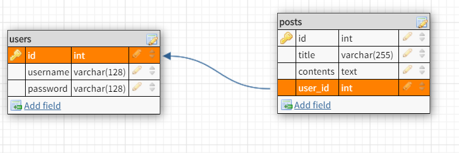

# How-To: Back-End
This is a **seperate alternative** API from the one in **Master** Branch

## Deployed backend url

https://how-to-app-kf.herokuapp.com/

## Getting Started
1) Clone this repository
2) `npm i` from root directory
3) `npm run server` to run server locally

## Database Schemas

The _Database Schemas_ for the `users` and `posts` resources are:

### Users

| field | data type        | metadata                                            |
| ----- | ---------------- | --------------------------------------------------- |
| id    | unsigned integer | primary key, auto-increments, generated by database |
| username | string        | required, unique                                    |
| password | string        | required                                            |

### Posts

| field   | data type        | metadata                                            |
| ------- | ---------------- | --------------------------------------------------- |
| id      | unsigned integer | primary key, auto-increments, generated by database |
| user_id | unsigned integer | required, must be the `id` of an existing `user`    |
| title   | string           | required                                            |
| contents | string           | required                                           |

## Endpoints

The API handles the following routes:

| Method | Endpoint                | Description                                                                                                                                                                 | Auth Required? |
| ------ | ----------------------- | --------------------------------------------------------------------------------------------------------------------------------------------------------------------------- | -------------- |
| POST   | /api/auth/register      | Creates a user using the information sent inside the `request body`.                                                                                                        | NO             |
| POST   | /api/auth/login         | Verifies credentials sent in the `request body` and returns a JWT used for the Authorization header.                                                                        | NO             |
| POST   | /api/howto              | Creates a new how-to post.                                                                                                                                                  | YES            |
| GET    | /api/users              | Returns all users.                                                                                                                                                          | YES            |
| GET    | /api/users/:id          | Returns the user with specified `id`.                                                                                                                                       | YES            |
| GET    | /api/howto              | Returns all how-to posts.                                                                                                                                                   | YES            |
| GET    | /api/howto/:id          | Returns the post with the specified `id`.                                                                                                                                   | YES            |
| GET    | /api/howto/user/:user_id | Returns an array of all post objects associated with the specified `user_id`.                                                                                              | YES            |
| PUT    | /api/howto/:id          | Updates the post with the specified `id` using data from the `request body`. Returns the modified post.                                                                     | YES            |
| DELETE | /api/howto/:id          | Removes the post with the specified `id`.                                                                                                                                   | YES            |

## Database Schema

